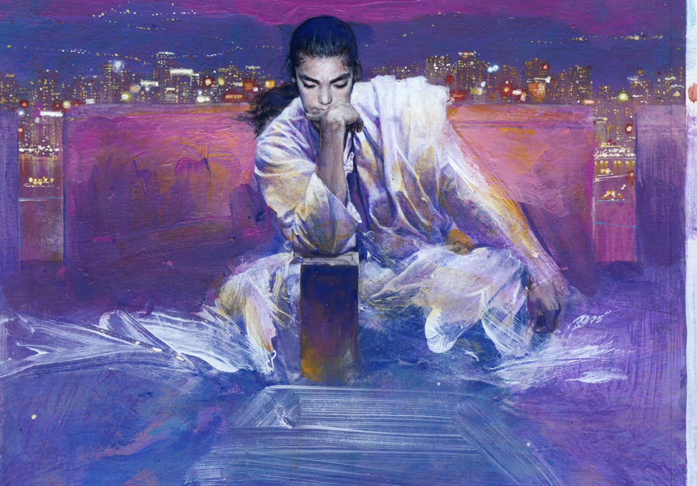

# Image Classification Workshop -- coding challenge submission

**organised by [Vancouver School of AI](https://www.facebook.com/groups/991378534367193/)**

**Date: 5pm 17 September 2018**

submission: [modified jupyter notebook](https://github.com/peter0083/van_ai_coding_challenge_1/blob/master/src/image_classification_part_1.ipynb)

This submission is a tribute to the late artist [Chen Uen 鄭問](https://en.wikipedia.org/wiki/Chen_Uen) who passed away in 2017. His work was influencial in East Asia. A model was trained to differentiate his illustration of the novel: *The Romance of the Three Kingdoms* and another famous artist [Nagano Tsuyoshi 長野 剛](https://en.wikipedia.org/wiki/Tsuyoshi_Nagano) who is well known for his character illustration of the same novel.

## Installation Requirements

Installation requirements can be found [here](https://github.com/johannesharmse/learn_image_classification/blob/master/docs/Requirements.md).

## Meetup Content

[Intro to the School of AI](https://docs.google.com/presentation/d/1mFC2Oh-iqVO1UHexSt2XP0RN_bq-yZPVBLSI7r3roLI/edit?usp=sharing)

[Image Classification Workshop](https://github.com/johannesharmse/learn_image_classification/blob/master/src/image_classification_part_1.ipynb)

## Content Authors

[Akshi Chaudhary](https://github.com/akshi8)

[Johannes Harmse](https://github.com/johannesharmse)

[Xinbin Huang](https://github.com/xinbinhuang)

## Adapted by 

[Peter Lin](https://github.com/peter0083)

## Resources and Additional Readings

[Tensorflow for Poets](https://codelabs.developers.google.com/codelabs/tensorflow-for-poets/#0)

[TensorFlow - Image Retraining](https://www.tensorflow.org/hub/tutorials/image_retraining)

[TensorBoard](https://www.tensorflow.org/guide/summaries_and_tensorboard)

